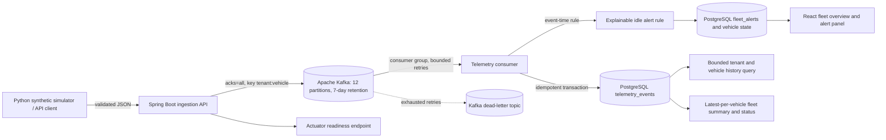
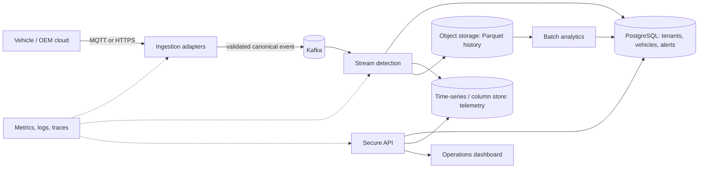

# Fleet Intelligence Platform — Architecture

## Current implemented architecture

Docker Compose defines the Spring Boot API, a local single-node Apache Kafka broker, PostgreSQL, and the React dashboard. The API validates a request and waits for its Kafka broker acknowledgement before returning `202 Accepted`. It partitions events by tenant and vehicle, uses idempotent producer settings with `acks=all`, and retains the main topic for seven days. A consumer group writes to PostgreSQL; the listener acknowledges a Kafka offset only after the database handler returns, while the database event key deduplicates redelivery. Processing failures use bounded exponential retry topics and route exhausted attempts to a dead-letter topic. A Testcontainers integration check verifies a new Kafka consumer group can replay an event from the retained log. The Python generator writes a seeded vehicle catalog and event stream as separate JSONL files, and automated tests verify 100,000 unique vehicle IDs and fleet-wide event coverage. Flyway creates telemetry, vehicle runtime state, and alert tables with bounded-query indexes. The API validates coordinates, speed, identifiers, and event time before publishing. A versioned event-time rule opens and resolves idling alerts with a documented fuel estimate; late events are stored but do not rewind live vehicle state. Alerts are `warning` when first opened and escalate to `critical` at `IDLE_CRITICAL_SECONDS` (900 seconds by default); open critical alerts appear first in API results. `GET /v1/fleet/overview` and `GET /v1/vehicles` aggregate each tenant's latest vehicle telemetry into fleet counts, current status, reported coordinates, and open-alert counts. The dashboard presents observed-vehicle signals alongside recent alerts and refreshes automatically; it does not claim a registered fleet inventory or display unconnected driver, maintenance, dispatch, or fuel-transaction workflows. GitHub Actions verifies the API-to-Kafka-to-PostgreSQL path with Testcontainers and builds the dashboard. The local Compose stack has been rebuilt and checked with all four services running and API readiness `UP`. The local broker is not highly available; shared deployment still needs a multi-broker configuration, TLS, access controls, and measured load evidence.

## Intended challenge architecture

This target architecture is a design direction, not implemented infrastructure. The product is the Fleet Intelligence Platform; prolonged idling is its first demonstration workflow, not its full scope. The broader fleet domain includes tenant, fleet, vehicle, trip, maintenance, alert, and user records. Store choices and CAP trade-offs are recorded as provisional ADRs in `docs/adr/`.

## Container and deployment deliverable

The current `Dockerfile` packages the API using a multi-stage Java build, and `frontend/Dockerfile` builds the dashboard into an Nginx image. Compose includes an Apache Kafka broker with persistent storage, PostgreSQL, API, and dashboard. Hosted API mode validates OAuth2/OIDC access tokens against `OIDC_ISSUER_URI`, requires `fleet.read` or `fleet.ingest` scope, and checks the signed `tenant_id` claim against the requested tenant or telemetry payload. Local Compose defaults to `FLEET_SECURITY_ENABLED=false` for a developer demo; it is not safe for shared exposure. The dashboard does not yet implement interactive OIDC login. The local broker is deliberately single-node and plaintext; multi-broker deployment, TLS, audit and privacy controls, high-volume telemetry storage, cloud deployment configuration, and scale evidence remain outstanding. Production secrets must come from the deployment environment, not the local example file.

## Data and consistency direction

- Tenant, vehicle, user, and alert acknowledgement records: relational store with transactional consistency.
- Raw telemetry: the implemented Kafka topic is partitioned and retained for seven days; a time-series or columnar store remains a target for measured high-volume workloads.
- Historical aggregates: object storage in a columnar format for economical batch analysis.
- Cache and vector store: defer unless a measured access pattern or grounded natural-language workflow needs them.

## API identity and tenant boundaries

When `FLEET_SECURITY_ENABLED=true`, the API is an OAuth2 resource server. It validates JWT signatures, issuer, and expiry using the issuer metadata/JWKS from `OIDC_ISSUER_URI`; read endpoints require `fleet.read`, ingestion requires `fleet.ingest`, and each request's `tenant_id` must exactly match the signed token claim. A JWT with no matching tenant claim is denied. Compose sets security false only for local demo convenience. This config does not provide a hosted identity provider, browser login, device mTLS, or audit logging; those remain deployment and product work.

## Capacity baseline from the brief

The case study estimates 100,000 vehicles at one event per second and approximately 1 KB per event: about 100,000 events/second and 8.6 TB/day before compression and down-sampling. The current platform has not been benchmarked at this load. The first load-test plan must include a 3x five-minute burst and report throughput, p95/p99 latency, error rate, and consumer lag.
