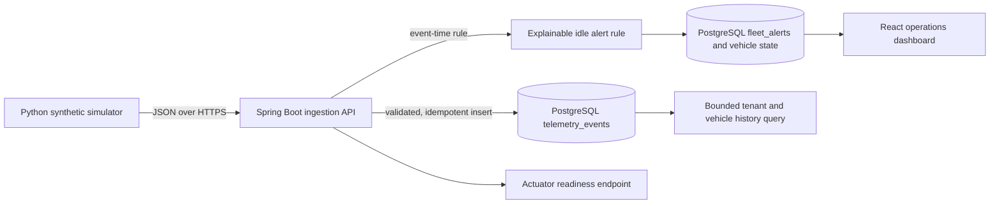
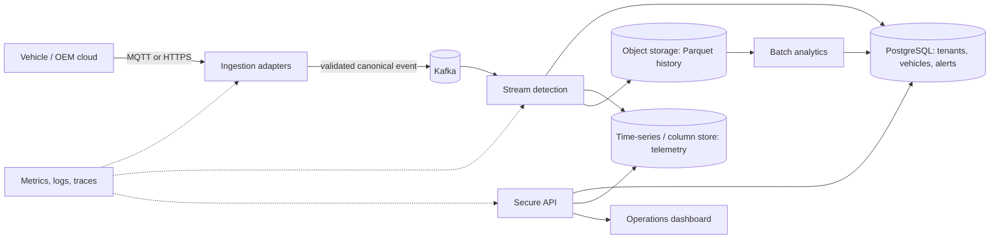

# Fleet Intelligence Platform — Architecture

## Current implemented architecture

Docker Compose runs the Spring Boot API, PostgreSQL, and React dashboard locally. The containers and a synthetic ingest-to-alert API flow have been verified; challenge-scale performance and cloud portability have not. Flyway creates the telemetry, vehicle runtime state, and alert tables with bounded-query indexes. PostgreSQL enforces uniqueness on `(tenant_id, event_id)`, so retries after a lost response do not create a second record for that tenant. The API validates coordinates, speed, identifiers, and event time before writing. A versioned event-time rule opens and resolves idling alerts with a documented fuel estimate; late events are stored but do not rewind live vehicle state. Alerts are `warning` when first opened and escalate to `critical` at `IDLE_CRITICAL_SECONDS` (900 seconds by default); this transparent demo policy puts open critical alerts first in API results. The dashboard filters alerts by tenant and vehicle, displays severity, and refreshes automatically. Authentication, Kafka stream processing, and high-volume benchmarks are not implemented yet.

## Intended challenge architecture

This target architecture is a design direction, not implemented infrastructure. The product is the Fleet Intelligence Platform; prolonged idling is its first demonstration workflow, not its full scope. The broader fleet domain includes tenant, fleet, vehicle, trip, maintenance, alert, and user records. Store choices and CAP trade-offs are recorded as provisional ADRs in `docs/adr/`.

## Container and deployment deliverable

The current `Dockerfile` packages the API using a multi-stage Java build, and `frontend/Dockerfile` builds the dashboard into an Nginx image. Compose starts those services with PostgreSQL, a persistent volume, and a database health check. The completed hackathon environment still needs the event broker, stream processor, high-volume telemetry store, simulator service integration, deployment configuration, scale evidence, and security controls. Production secrets must come from the deployment environment, not the local example file. The API is not yet protected by authentication or tenant authorization and is intended for local development only.

## Data and consistency direction

- Tenant, vehicle, user, and alert acknowledgement records: relational store with transactional consistency.
- Raw telemetry: partitioned append-only stream and time-series or columnar store; eventual visibility is acceptable for most dashboards.
- Historical aggregates: object storage in a columnar format for economical batch analysis.
- Cache and vector store: defer unless a measured access pattern or grounded natural-language workflow needs them.

## Capacity baseline from the brief

The case study estimates 100,000 vehicles at one event per second and approximately 1 KB per event: about 100,000 events/second and 8.6 TB/day before compression and down-sampling. The current platform has not been benchmarked at this load. The first load-test plan must include a 3x five-minute burst and report throughput, p95/p99 latency, error rate, and consumer lag.
