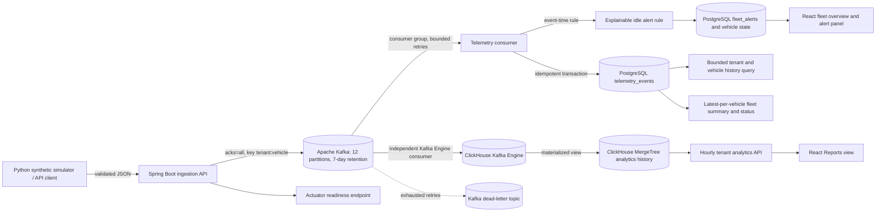
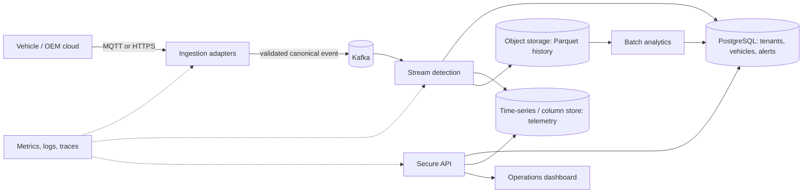
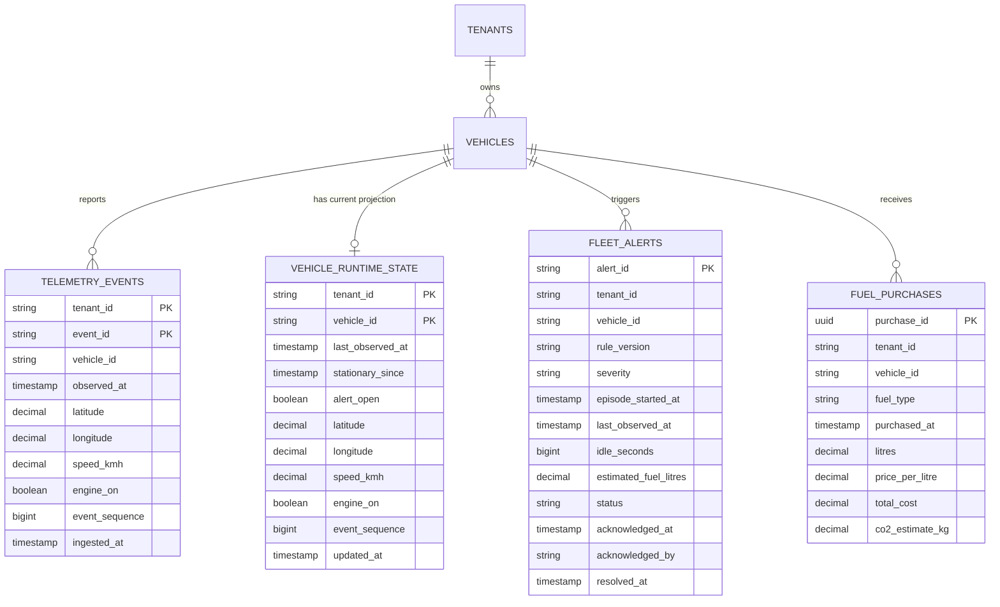
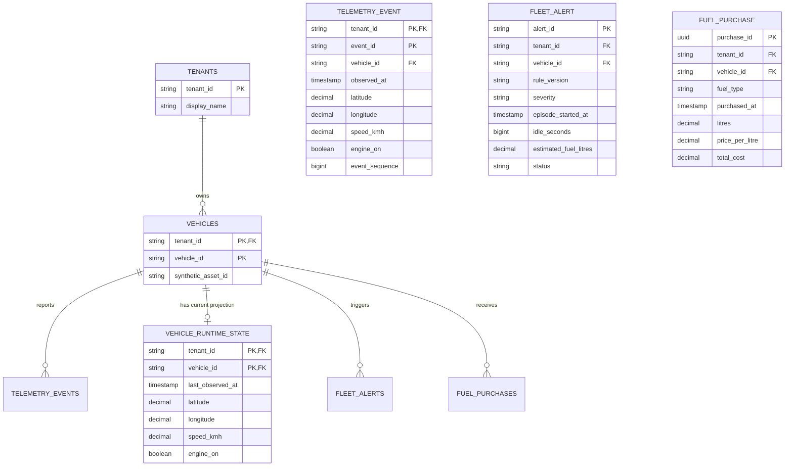

# Fleet Intelligence Platform — Architecture

## Current implemented architecture

Docker Compose defines six services when the optional simulator profile is enabled: Spring Boot API, local single-node Apache Kafka broker, PostgreSQL, ClickHouse, React dashboard, and Python live simulator. The API validates each telemetry event and waits for broker acknowledgement before returning `202 Accepted`. The topic has 12 partitions and seven-day retention. The application consumer writes idempotently to PostgreSQL and evaluates idling rules; an independent ClickHouse Kafka Engine/materialized-view path stores analytics history in a monthly-partitioned MergeTree table with a 90-day TTL. Reports uses exact hourly rollups for full hours and raw events only at partial-hour boundaries. The 100,000-record catalog and deterministic event coverage are verified by simulator tests.

The local runtime was checked on 2026-10-01: API readiness and dashboard returned HTTP 200, and the tenant overview represented 100,000 vehicles. A 37-hour Reports request took about 0.2 seconds after rollup optimization. This is a single local observation, not a benchmark. A short 5-events/second simulator check showed the dashboard updating; it does not prove high-rate broker-to-ClickHouse ingestion, 100,000 events/second, burst tolerance, or loss-free operation. The local Kafka broker remains a single point of failure. For the current code and CI references, see the dated status in `docs/AGENT_HANDOFF.md`; this project mirror has no Git metadata, so its local changes must not be described as published commits.

## Intended challenge architecture

This target architecture is a design direction beyond the current Kafka/PostgreSQL/ClickHouse demo path. The product is the Fleet Intelligence Platform; prolonged idling is its first demonstration workflow, not its full scope. The broader fleet domain includes tenant, fleet, vehicle, trip, maintenance, alert, and user records. Store choices and CAP trade-offs are recorded as provisional ADRs in `docs/adr/`.

## Container and deployment deliverable

The current `Dockerfile` packages the API using a multi-stage Java build, and `frontend/Dockerfile` builds the dashboard into an Nginx image. Compose includes Kafka, PostgreSQL, ClickHouse, API, and dashboard. Hosted API mode validates OAuth2/OIDC access tokens and tenant claims; local Compose disables it for the developer demo. The dashboard does not yet implement interactive OIDC login. The local broker is deliberately single-node and plaintext; multi-broker deployment, TLS, audit and privacy controls, cloud deployment configuration, and scale evidence remain outstanding. The local stack and its core routes were checked on 2026-10-01; see `evidences/2026-10-01/local-stack-check.md`. A clean-clone startup with an empty disposable volume has not been verified. Production secrets must come from the deployment environment, not the local example file.

## Data and consistency direction

- Telemetry events, current vehicle runtime state, idling alerts, and synthetic refuelling purchases: PostgreSQL. Event identity is unique by `(tenant_id, event_id)`; the API's current and analytics endpoints are tenant-scoped.
- Raw telemetry: Kafka is partitioned and retained for seven days. ClickHouse is an analytical copy retained for 90 days. Its hourly rollup deduplicates event IDs so Kafka redelivery does not inflate event counts.
- Historical analytics: ClickHouse materializes exact hourly aggregates. Reports reads complete-hour rollups and scans raw rows only for partial-hour boundaries. Object storage in a columnar format remains a future option for longer, lower-cost batch retention.
- Cache and vector store: defer unless a measured access pattern or grounded natural-language workflow needs them.

## Relational schema and normalization status

The first diagram records the pre-V6 logical data shape for historical context. V6 subsequently added the tenant and vehicle master tables and enforced tenant-scoped foreign keys; the post-V6 schema below is the current relational model.

`V6__normalize_tenant_vehicle_ownership.sql` creates tenant and tenant-scoped vehicle identity records, backfills them from telemetry, operational state, alerts, and fuel purchases, then enforces composite foreign keys for all four data tables. New telemetry registers its tenant and vehicle in the same PostgreSQL transaction after the idempotent event insert and before transaction commit. `telemetry_events` remains append-only event identity/history; `vehicle_runtime_state` and `fleet_alerts` remain intentionally derived operational projections. Fuel purchase cost and CO₂ are generated columns derived from litres, fuel type, and price. The catalog currently stores identity and registration time only; descriptive vehicle metadata is not available in the simulator schema. Backend integration tests passed on a fresh PostgreSQL database, and a separate disposable migration check applied V6 over 100,000 existing synthetic events plus legacy alert/fuel rows and confirmed the backfill and foreign keys. The persistent local Compose database was migrated through V6 and checked on 2026-10-01, as recorded in `evidences/2026-10-01/local-stack-check.md`.

The following shows the relational ownership and operational schema after V6; derived projections are intentionally denormalized for current-state reads:

In implementation, each `vehicle_id` reference in a tenant-scoped child table needs a composite foreign key `(tenant_id, vehicle_id)` to prevent cross-tenant references. Keep latest vehicle state as an explicitly denormalized projection for fast fleet summaries; do not duplicate vehicle descriptive attributes into telemetry events. Migration work must backfill 100,000 vehicles and existing telemetry references before constraints are enabled, then verify rollback/replay behavior.

## API identity and tenant boundaries

When `FLEET_SECURITY_ENABLED=true`, the API is an OAuth2 resource server. It validates JWT signatures, issuer, and expiry using the issuer metadata/JWKS from `OIDC_ISSUER_URI`; read endpoints require `fleet.read`, ingestion requires `fleet.ingest`, and each request's `tenant_id` must exactly match the signed token claim. A JWT with no matching tenant claim is denied. Compose sets security false only for local demo convenience. This config does not provide a hosted identity provider, browser login, device mTLS, or audit logging; those remain deployment and product work.

## Capacity baseline from the brief

The case study estimates 100,000 vehicles at one event per second and approximately 1 KB per event: about 100,000 events/second and 8.6 TB/day before compression and down-sampling. The current platform has not been benchmarked at this load. The first load-test plan must include a 3x five-minute burst and report throughput, p95/p99 latency, error rate, and consumer lag.
