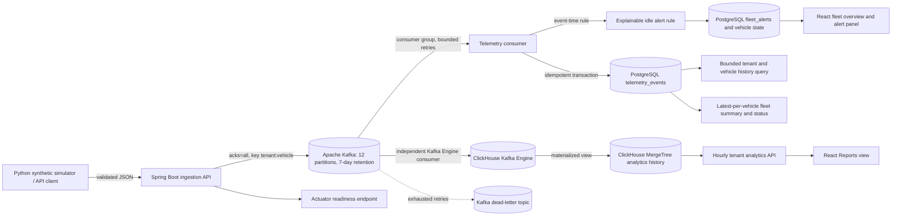
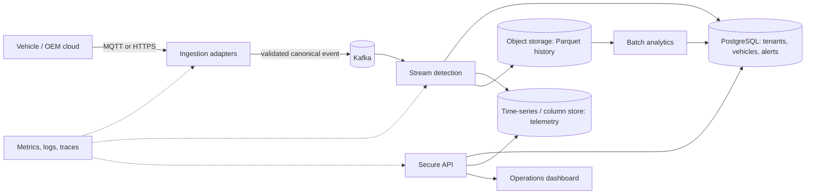

# Fleet Intelligence Platform — Architecture

## Current implemented architecture

Docker Compose defines the Spring Boot API, a local single-node Apache Kafka broker, PostgreSQL, ClickHouse, and the React dashboard. The API validates a request and waits for Kafka acknowledgement before returning `202 Accepted`. The main topic has 12 partitions and seven-day retention. One consumer group writes to PostgreSQL for transactional state and alert detection; an independent ClickHouse Kafka Engine table plus materialized view writes analytical history into a monthly-partitioned MergeTree table with 90-day TTL. `GET /v1/analytics/telemetry/hourly` provides bounded hourly aggregates for the Reports view. The Python generator writes seeded synthetic data; tests verify its 100,000-vehicle catalog and event coverage. GitHub Actions previously verified the API-to-Kafka-to-PostgreSQL path and frontend build; the newly added analytics backend has not yet had a CI run. The current five-service Compose stack has not yet been rebuilt and verified. The local broker is not highly available, and no scale or latency results have been measured.

## Intended challenge architecture

This target architecture is a design direction beyond the current Kafka/PostgreSQL/ClickHouse demo path. The product is the Fleet Intelligence Platform; prolonged idling is its first demonstration workflow, not its full scope. The broader fleet domain includes tenant, fleet, vehicle, trip, maintenance, alert, and user records. Store choices and CAP trade-offs are recorded as provisional ADRs in `docs/adr/`.

## Container and deployment deliverable

The current `Dockerfile` packages the API using a multi-stage Java build, and `frontend/Dockerfile` builds the dashboard into an Nginx image. Compose includes Kafka, PostgreSQL, ClickHouse, API, and dashboard. Hosted API mode validates OAuth2/OIDC access tokens and tenant claims; local Compose disables it for the developer demo. The dashboard does not yet implement interactive OIDC login. The local broker is deliberately single-node and plaintext; multi-broker deployment, TLS, audit and privacy controls, cloud deployment configuration, and scale evidence remain outstanding. The current Compose changes still need a successful rebuild/runtime check. Production secrets must come from the deployment environment, not the local example file.

## Data and consistency direction

- Tenant, vehicle, user, and alert acknowledgement records: relational store with transactional consistency.
- Raw telemetry: Kafka is partitioned and retained for seven days. ClickHouse is the analytical copy, retained for 90 days, with `uniqExact(event_id)` in hourly queries to avoid inflating distinct event counts on Kafka redelivery.
- Historical aggregates: the current Reports API calculates hourly aggregates on demand. Object storage in a columnar format remains a future option for longer, lower-cost batch retention.
- Cache and vector store: defer unless a measured access pattern or grounded natural-language workflow needs them.

## API identity and tenant boundaries

When `FLEET_SECURITY_ENABLED=true`, the API is an OAuth2 resource server. It validates JWT signatures, issuer, and expiry using the issuer metadata/JWKS from `OIDC_ISSUER_URI`; read endpoints require `fleet.read`, ingestion requires `fleet.ingest`, and each request's `tenant_id` must exactly match the signed token claim. A JWT with no matching tenant claim is denied. Compose sets security false only for local demo convenience. This config does not provide a hosted identity provider, browser login, device mTLS, or audit logging; those remain deployment and product work.

## Capacity baseline from the brief

The case study estimates 100,000 vehicles at one event per second and approximately 1 KB per event: about 100,000 events/second and 8.6 TB/day before compression and down-sampling. The current platform has not been benchmarked at this load. The first load-test plan must include a 3x five-minute burst and report throughput, p95/p99 latency, error rate, and consumer lag.
