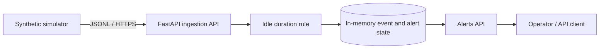
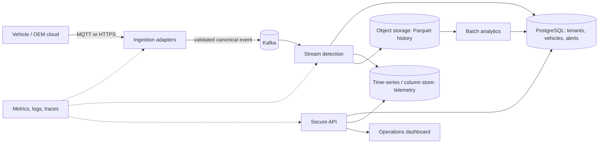

# Fleet Intelligence Platform — Architecture

## Current starter architecture

The current API is a single process. Event IDs are de-duplicated in memory; state is lost at restart. It is suitable for local iteration only.

## Intended challenge architecture

This target architecture is a design direction, not implemented infrastructure. The product is the Fleet Intelligence Platform; prolonged idling is its first demonstration workflow, not its full scope. The broader fleet domain includes tenant, fleet, vehicle, trip, maintenance, alert, and user records. Store choices and CAP trade-offs are recorded as provisional ADRs in `docs/adr/`.

## Container and deployment deliverable

The current `Dockerfile` packages only the starter API, and the current `compose.yaml` starts only that API. The hackathon deliverable needs a reproducible containerized environment for the actual end-to-end system: ingestion/API, simulator or load generator, event broker, relational and telemetry stores, stream processor, and web dashboard. Compose is the local demonstration profile; deployment manifests and environment-specific configuration must make the same services portable to the selected cloud. Containers must use configurable secrets, health checks, persistent volumes where needed, and documented startup/shutdown steps. The finished stack must be started and exercised together before claiming the Docker deliverable is complete.

## Data and consistency direction

- Tenant, vehicle, user, and alert acknowledgement records: relational store with transactional consistency.
- Raw telemetry: partitioned append-only stream and time-series or columnar store; eventual visibility is acceptable for most dashboards.
- Historical aggregates: object storage in a columnar format for economical batch analysis.
- Cache and vector store: defer unless a measured access pattern or grounded natural-language workflow needs them.

## Capacity baseline from the brief

The case study estimates 100,000 vehicles at one event per second and approximately 1 KB per event: about 100,000 events/second and 8.6 TB/day before compression and down-sampling. FleetPulse has not been benchmarked at this load. The first load-test plan must include a 3x five-minute burst and report throughput, p95/p99 latency, error rate, and consumer lag.
